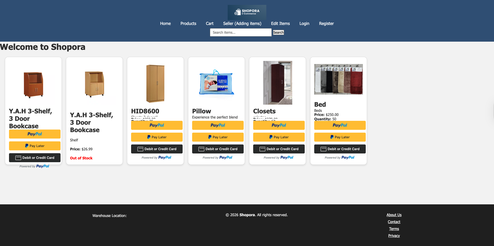
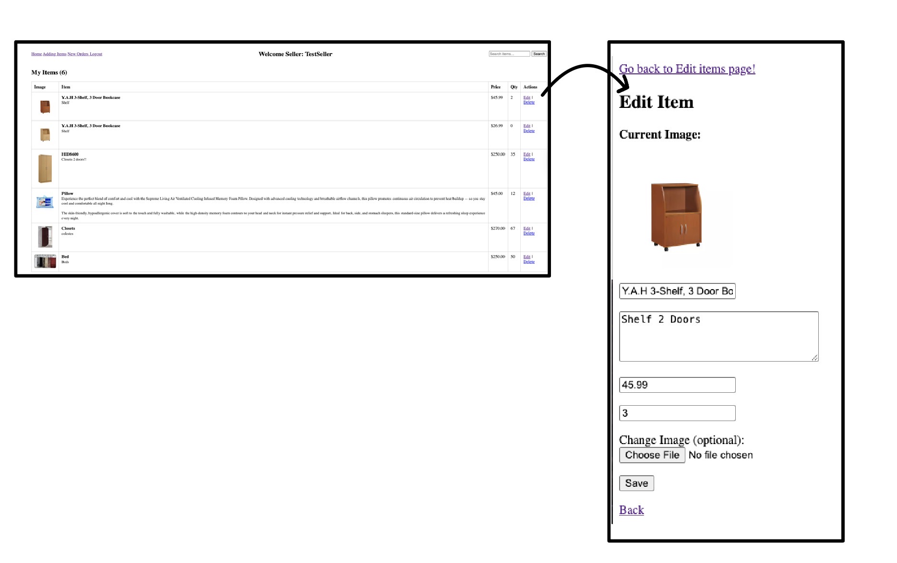
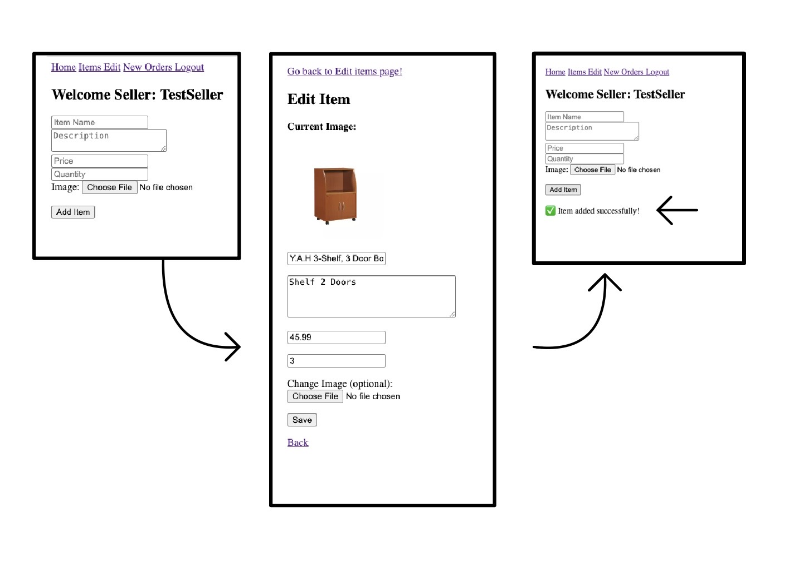

**Status:** Actively Improving (Orders System in Progress)

# Shopora – PHP E-Commerce Web Application 🛒🌐📦

Shopora is a full-stack e-commerce web application built using PHP and MySQL.  
It allows users to register, log in, browse products, and sellers to manage inventory.

---

## 🚀 Features

### 🔐 Authentication
- User registration
- Secure login & logout
- Session-based authentication

### 🛍 Product Management (Seller)
- Add new items
- Edit existing items
- Delete items
- Image upload support
- Quantity tracking

### 🔎 Search Functionality
- Search by product name
- Search by product description
- Uses prepared statements to prevent SQL injection

### 💳 Payments
- PayPal integration for checkout

---

## 🛠 Tech Stack

- PHP (Core PHP)
- MySQL (mysqli)
- HTML5 / CSS3
- PayPal SDK

---

## 🔒 Security Practices

- Prepared statements (prevents SQL injection)
- `htmlspecialchars()` to prevent XSS
- Session-based login system
- Password hashing using `password_hash()` and `password_verify()`

---

## 🧾 Orders System (In Progress)

The Orders system is currently under development.

Planned functionality:
- Store completed PayPal transactions
- Save order details to database
- View order history
- Seller order management dashboard
- Update order status (Processing / Shipped / Completed)

This feature is being actively developed and will connect payment confirmations to stored order records.
---
## Database Schema

The application uses MySQL to store user accounts and product listings.

### users
| Column | Type |
|------|------|
| id | INT (Primary Key) |
| username | VARCHAR |
| email | VARCHAR |
| password | VARCHAR |
| created_at | TIMESTAMP |

### items
| Column | Type |
|------|------|
| id | INT (Primary Key) |
| name | VARCHAR |
| description | TEXT |
| price | DECIMAL |
| image | VARCHAR |
| created_at | TIMESTAMP |
---
## 📸 Screenshots

## Home page 

Displays products dynamically from the MySQL database with inventory tracking and PayPal checkout integration.

## 📦 Seller Dashboard

Authenticated sellers can manage inventory, edit product details, update quantities, and upload images through the Seller Dashboard.
## 🛠 Product Management Workflow

Sellers can add products, edit inventory information, upload images, and receive confirmation feedback after successful database updates.

### Edit Item

## 📂 Project Structure
